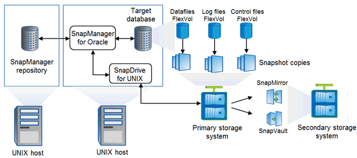

= Architektur von SnapManager
:allow-uri-read: 
:icons: font
:imagesdir: ../media/

[role="lead"]
SnapManager für Oracle enthält Komponenten, die gemeinsam eine umfassende und leistungsstarke Backup-, Restore-, Recovery- und Klonlösung für Oracle Datenbanken bieten.

== SnapDrive für UNIX

SnapManager benötigt SnapDrive, um die Verbindung zum Storage-System herzustellen. Sie müssen SnapDrive for UNIX auf jedem Ziel-Datenbank-Host installieren, bevor Sie SnapManager installieren.

== SnapManager für Oracle

Sie müssen SnapManager für Oracle auf jedem Ziel-Datenbank-Host installieren.

Sie können entweder die Befehlszeilenschnittstelle (CLI) oder die Benutzeroberfläche vom Datenbank-Host verwenden, auf dem SnapManager für Oracle installiert ist. Sie können die SnapManager-Benutzeroberfläche auch Remote verwenden, indem Sie einen Webbrowser von jedem System verwenden, das auf einem von SnapManager unterstützten Betriebssystem ausgeführt wird.

NOTE: Die unterstützten JRE-Versionen sind 1.5, 1.6, 1.7 und 1.8.

== Zieldatenbank

Die Zieldatenbank ist eine Oracle Datenbank, die Sie mit SnapManager managen möchten, indem Sie Backup-, Restore-, Recovery- und Klonvorgänge durchführen.

Die Zieldatenbank kann eine eigenständige Real Application Clusters (RAC) sein oder auf Oracle Automatic Storage Management (ASM)-Volumes residieren. Weitere Informationen zu den unterstützten Oracle Datenbankversionen, Konfigurationen, Betriebssystemen und Protokollen finden Sie im NetApp Interoperabilitäts-Matrix-Tool.

== SnapManager Repository

Das SnapManager Repository befindet sich in einer Oracle Datenbank und speichert Metadaten zu Profilen, Backups, Restores, Recoverys und Klonen. Ein einziges Repository kann Informationen über Vorgänge enthalten, die an mehreren Datenbankprofilen durchgeführt werden.

Das SnapManager-Repository kann sich nicht in der Zieldatenbank befinden. Die SnapManager-Repository-Datenbank und die Zieldatenbank müssen online sein, bevor SnapManager Vorgänge durchgeführt werden können.

== Primärspeicher

SnapManager sichert die Zieldatenbanken auf dem primären NetApp Storage-System.

== Sekundäres Storage-System

Wenn Sie die Datensicherung in einem Datenbankprofil ermöglichen, werden die Backups, die von SnapManager auf dem primären Storage-System erstellt wurden, mithilfe von SnapVault und SnapMirror Technologien auf ein sekundäres NetApp Storage-System repliziert.

*Verwandte Informationen*

http://mysupport.netapp.com/matrix["NetApp Interoperabilitäts-Matrix-Tool"]
